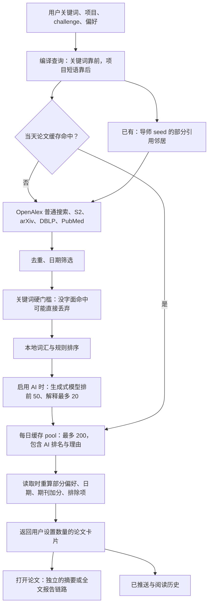
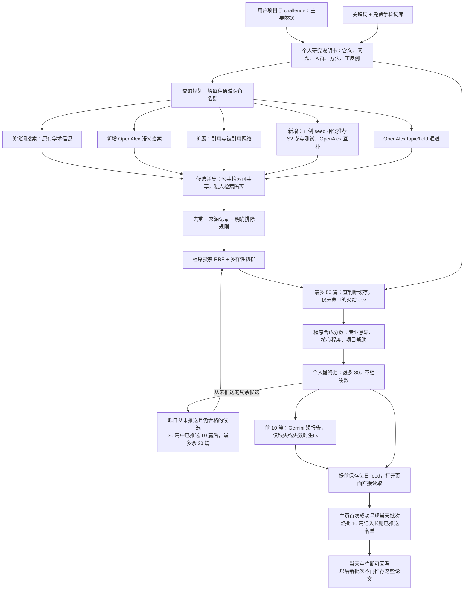

# Peer：Jev 接入与论文筛选升级计划

核查日期：2026-09-21。状态：规划完成，功能尚未实施。

本次更新采纳用户的新决定：保留 Semantic Scholar 参与实际评测；续存的是“从未推送到主页”的论文，不是“尚未读完”的论文。第 2 节描述现有代码，第 3 节起描述待实现方案，不能把新图当作已经上线的功能。

分支：`Jev-integration-and-sorting-filtering-enhancement`。Git 不允许空格，因此使用这个合法名称。起点为 `complimentary-enhancement-to-main-update` 的 `8fa4360e6925bfb7f6ff874d553b16e0ec47b8d7`，保留其已有的 34 个领先远端提交。本轮不提交、不推送、不部署，也不调用收费模型。

## 1. 一句话结论

让不同工具各做擅长的事情：**项目描述告诉系统“你要解决什么”；多个搜索通道尽量找全；普通程序合并排名；Jev 判断专业含义；Gemini 为少量精选论文写解释；数据库记住已经做过的工作。**

这不是简单多加一个 AI。先修复“好论文进不来”和“不同人的结果混在一起”，Jev 才有机会发挥作用。准确率和节省比例必须实测，不能从厂商宣传推算。

## 2. 目前实际结构：已有 pool，但不是理想的共享图书馆



图中模型不一定是 Gemini，但你目前主要使用 Gemini。不开 AI 时仍走本地规则。

“前面的查询更容易被执行”好比给图书管理员一张清单，但他只能查前三项。如果清单前三项都是 `conflict` 等关键词，后面的“员工角色冲突与离职意向”就可能轮不到。因此问题不是用户没提供背景，而是背景没有得到足够的检索机会。

所谓“无上下文”，就是只看纸上有没有这个词，不看它在这篇文章里是什么意思。例如材料学的 SEM 与统计学的 SEM 不能无条件当成同一个东西；当前词表主要照顾材料相关缩写。本地 Tier 1 目前也不是向量搜索。

### 现有缓存风险，具体是什么？

Pool 就是一篮已经搜集、筛过的论文。Cache key 就是篮子上的标签：以后看到同样标签就直接取篮子，不再花钱重做。

目前论文标签主要记录 topics、探索 topics、上传兴趣、AI tier 和日期；没有完整记录项目、challenge、方法、期刊、排除偏好、控制参数、导师 seed 或用户身份。但是建篮子时又确实使用了其中许多信息，并保存 AI 理由。

假设 A 研究员工冲突，B 研究软件版本冲突，二人填写相同的 `conflict`。如果其他标签字段也相同，B 可能拿到按 A 的背景做出的篮子。读取时再调整部分分数，并不能找回之前没搜到的论文，也不能可靠纠正已缓存的理由。这是可由代码推出的风险，**不是已经证实发生过的数据泄露事件**。

本地开发缓存写磁盘；部署环境的适配器使用 Supabase `opportunity_pools`。数据库权限并不等于业务隔离：即使浏览器不能直接读表，服务器拿错篮子仍然可能返回不属于该用户的理由。

还有两个已有基础不能忽略：

- 已有 `/api/jobs/dispatch-digests` 定时摘要入口，按用户时区运行逻辑，但目前强制 Tier 0，并排除近 30 天已经推送的论文。代码存在不等于生产定时器已正确配置，实施时要核实。
- 已有 `readItems`、`readAt`、反馈与展示历史。阅读页已经尝试区分“打开”和“读到决策位置/做出动作”，不是简单一打开就算读完。这些状态继续用于阅读记录，但新方案是否再次推荐只看“是否曾推送”，不再由读完与否决定。现有近期开关/历史不能冒充永久去重账本。

## 3. 新结构：共享找论文，单独判断适不适合你



这里“前 10 篇报告”是帮助决定要不要读的**短报告**。现有全文深度报告仍由用户点击后生成，不默认每天做 10 份全文分析。内部最多 30 篇是候选储备，不意味着首页强塞 30 篇；首页仍遵循少量精选、尊重现有数量设置。

### 3.1 先读懂需求，再去搜索

保存用户原始描述，编译成版本化的“研究说明卡”：研究领域、术语含义、当前问题、人群、方法、结果指标、明确排除项、正例与反例论文。必须区分“硬要求”和“更喜欢”。

例如用户说“缺乏纵向研究”，不能擅自理解成“只允许纵向论文”。不确定就保持为偏好或向用户简短求证，不猜测。

查询不再共用一个“取前三条就结束”的列表，而是分通道安排：项目语义查询一定有自己的名额；关键词负责准确名称；seed 与引文负责邻近研究。用户修改项目时才重新编译，必要时让 Gemini 帮助整理一次，不每天重复整理。无 AI 时仍可以直接使用用户原文与确定性抽取。

给外部搜索服务发送的是必要、最小的研究描述；个人姓名、未发表细节等不默认外发。用户启用云端 AI 时需要清楚知道会向哪些服务发送什么。公共概念缓存不保存私人项目原文。

### 3.2 多路入围，不再只认字

满足以下任意一个通道，即可进入候选篮子，不等于保证最终推荐：

`关键词命中 OR 语义命中 OR 正例 seed 相似 OR 引用邻居 OR topic/field 匹配`

保留用户明确排除、日期范围等规则；不把“缺失摘要”误判为“不相关”。宽泛的 field 只能提供受限数量的探索候选，不能把整个学科全搬进来。

先按 DOI 和来源 ID 去重；没有 ID 再使用标准化标题并检查年份、作者，避免把同名不同论文合并。保留所有来源、通道和原排名。

RRF 可以理解为按名次投票：不同通道排得越靠前，票越多。一个通道换了十种关键词，不能因此拥有十倍投票权；先在通道内合并，再跨通道投票。它不调用模型，但有少量服务器计算成本。

### 3.3 已有与新增的边界

| 能力 | 当前情况 | 本次计划 |
|---|---|---|
| 多学术来源关键词搜索 | 已有 | 保留，改成项目导向的查询计划 |
| OpenAlex 普通搜索及 topic 标签 | 已有 | 保留并升级认证、调度；新增独立 topic 召回 |
| OpenAlex 语义搜索 | 主 feed 尚未接入 | 新增并集通道 |
| 引用网络 | 已有导师 seed 的有限邻居 | 扩展为用户正例 seed 的受限双向网络 |
| seed 相似推荐 | 尚无完整独立通道 | 新增 S2 推荐评测与 OpenAlex 语义近邻，比较互补性；排除 seed 自身 |
| 去重、本地排序、每日 pool | 已有 | 增强来源追踪、RRF，拆分缓存 |
| Jev 判断 | 尚未接入 | 新增 DecisionProvider |
| 定时摘要 | 已有入口 | 改成入队、提前准备、原子发布快照 |
| 未推送续存、永久推送账本和分布式配额 | 尚无本方案的完整实现 | 新做；阅读、点击、反馈与推送资格分开 |

**Semantic Scholar（S2）保留为测试阶段的主动通道，包括现有搜索与新增 seed 推荐。**不能只因未来可能商用就提前删除或关闭，否则无法知道它好不好。评测使用相同项目和正例，分别记录 S2 独有好论文、OpenAlex 独有好论文、交集、并集新增价值、前排质量、延迟和用量；同时比较 seed 推荐与关键词搜索。

但公开、免费、尚未收费，都不自动等于所有测试均获得授权。实际调用前核对其非商业研究等内部用途范围；面向未来商业产品的客户测试不能仅凭“测试阶段”认定覆盖。超出许可范围时标记对应 live 评测被授权阻塞，继续本地接口与离线测试，不伪造结果、不自行提交申请或接受新条款。商业发布仍需确认适用授权；真正不可用时以 OpenAlex 降级，不能把“降级方案”当成跳过 S2 评测的理由。见 [S2 官方条款](https://api.semanticscholar.org/license/)。Tavily 不作为这一版的必要依赖；它能补网页发现，不能替代专业词义判断。

## 4. Jev 如何接入，而不是神奇地“全懂”

新增一个独立的 `DecisionProvider`，专门输出结构化判断；Gemini 留在生成报告的接口里。两者不是同一个接口硬塞两个名字。

每篇论文给 Jev：标题、可获得的摘要、适量元数据、研究说明卡和相关概念定义。把一个笼统的“好不好”拆成几个小问题：

1. 这里的 conflict 是否指我们要的 HR 含义，而不是利益冲突声明或软件冲突？
2. 这个概念是研究核心，还是背景里提了一次？
3. 人群是否匹配？没有说明就回答“信息不足”。
4. 方法或结果指标是否符合用户实际提出的要求？没提出就不问这项。
5. 对当前 challenge 是否有直接帮助？

用 Choice/Score 返回选择、分数和置信信息，再由程序合成排序。题目允许“信息不足”，不强迫所有情况二选一。Jev 官方支持同一段资料上分别回答多个小问题，但它们彼此独立：一个问题不能依赖另一个问题刚推出来的答案。见 [官方机制](https://docs.typesafe.ai/introduction)。

**它确实是在根据自然语言上下文做语义判断，不是查关键词表；但不能保证正确，也不能从摘要读出摘要没有说的内容。**它不是全文搜索器，更救不回从未入围的论文。高置信错误也可能发生，要用真实 HR 样本校准。

初期规则：明确不符合且证据充分才降级/排除；资料不足保留不确定标记，不直接扔掉。少量边界候选可交 Gemini 复核，默认每次最多 5 篇且受预算控制；更常见的降级路径是保留本地排序，不用昂贵模型补齐所有失败。

Jev 替换的是原来“用生成式模型为 50 篇排序并写很多理由”的工作，不是简单叠加一轮。判断结果按用户、项目版本、论文内容版本、问题版本、模型版本缓存；第二天日期变化本身不让语义判断失效。最新日期加分和多样性由程序重算。

### 成本只能先估，再量

官方当前 Jev 1.13 输入为 $0.042 / 百万 token，输出不收费；生产应固定版本，语言和实际任务表现需测试。见 [模型与价格](https://docs.typesafe.ai/models)。

估算假设：每人每天判断 50 篇，30 天，每篇标题、摘要、说明卡和问题合计 1,500–2,500 个输入 token，无缓存、无重试。不是实际测量结果。

| 每月活跃用户 | 仅 Jev 月费估算 |
|---:|---:|
| 10 | $0.95–1.58 |
| 100 | $9.45–15.75 |
| 1,000 | $94.50–157.50 |

公式：用户数 × 活跃天数 × 实际未缓存论文数 × 实际输入 token × 0.042 / 1,000,000。

这不含 Gemini、OpenAlex、Supabase、网络、复核、重试及税费。若每次有 20/50 篇命中判断缓存，理论上这部分判断费降低 40%，不是整个平台总账单降低 40%。也不能现在保证比旧系统节省某个百分比：要对同一批输入比较旧 Gemini 排序、新 Jev 排序，以及两者最终的报告支出。

## 5. OpenAlex：一个公司 key 可以起步，但大家共用同一份额度

建议申请**公司拥有的 OpenAlex API key**，所有用户通过 Peer 后端访问，不需要每位用户申请。一个 key 能提供普通检索和语义检索，无需另买“语义专用 key”。达到更大用量时升级公司账户或补充额度，不通过多 key 绕开限速。

Supabase 是保管密钥、运行后端和保存数据的地方，不是替第三方 API 统一结账的支付平台；公司仍分别承担各供应商账单。

截至核查日：普通搜索和语义搜索均约 $0.001/请求；有 key 的账户每日免费 $1，所有调用共用额度。语义搜索每次最多 50 结果、输入最多 2,000 字符、限速 1 请求/秒；不能把普通分页的 100 条规则套到它身上。见 [费用](https://help.openalex.org/access/example-costs/) 与 [语义接口](https://help.openalex.org/api/semantic-search/)。

例子：100 个可共享的检索配方，每天各跑一次关键词、一次语义，约 200 次搜索、$0.20 的用量。1,000 个配方约 $2/天；假设没有其他调用占用免费额，超出部分约 $1/天，30 天约 $30。引用、过滤、重试和私人查询另计。1,000 次语义请求按该限速，单队列至少约 17 分钟，因此需要后台错峰。

### 5.1 不是“相同单词搜一次”，而是“相同检索配方搜一次”

`conflict + HR 含义` 与 `conflict + 软件含义` 不是同一配方。配方要包含：概念 ID/含义、查询语言、信源、通道、查询内容、日期窗口、过滤条件、检索参数和版本。

这些内容生成一个指纹，像配方的条形码。相同配方在同一个更新周期复用结果；多用户会受益，但不保证一个概念整个系统每天只产生一次 HTTP 请求：关键词、语义、不同过滤条件和分页仍可能分别调用。

共享的检索周期建议用统一 UTC 时间段，用户每日 feed 则按自己的时区生成，避免“同一查询因不同时区又搜一次”。冷启动按需入队，只预热仍有活跃订阅者的配方，不预生成整个学术世界。

### 5.2 三层存储，避免混成一口大锅

| 层 | 放什么 | 共享边界 |
|---|---|---|
| 公共论文库 | 论文 ID、题目、可合法缓存的元数据、版本和来源 | 相同论文尽量只存一份；不代表 PDF/摘要版权自动开放 |
| 检索篮子 | 某个配方找到哪些 ID、各通道名次、更新时间、是否完整 | 经过公共化审核的普通概念可以共享；自定义/私人项目查询默认按用户隔离 |
| 个人工作台 | 研究说明卡、Jev 判断、排序理由、阅读状态、最终池与报告；另有长期推送账本 | 个性化内容按用户/项目隔离；主页去重账本按用户跨项目生效，启用行权限和后端身份校验 |

用户不需要也不应该看到“所有其他用户搜索了什么”。私人查询即使只存 hash，也不自动变成公开、安全的数据；共同论文记录可以复用，私人搜索关联和判断不能串用。

先修旧问题：给个性化缓存加 owner 与完整语义版本，升级缓存命名空间，使旧的混合 AI pool 不再命中。随后拆出真正共享的检索结果。不要只给旧 key 多塞两个字段就宣称问题解决。

## 6. 后台提前做、刷新排队，以及公司密钥

建立 Supabase Cron → 持久队列 → 短批 worker → 每日快照。复用现有定时摘要入口，但它只负责安排工作，不在一次长请求中顺序跑完所有用户。技术基础见 [Supabase Queues](https://supabase.com/docs/guides/queues) 与 [Cron](https://supabase.com/docs/guides/cron)。

建议的初始操作规则，均作为可调配置而非质量保证：

1. 在用户设定的阅读时间前 30–60 分钟入队；没有设置时使用清楚可见的产品默认时间。只为近期活跃或明确开启订阅的用户准备。
2. 同一配方同一周期只能有一个有效任务；必须由数据库约束和锁保证，不能只在某一台服务器内去重。
3. 所有 worker 共用供应商限速器和每日支出上限。遇到 429 按 Retry-After 等待，限次重试；部分信源失败不能缓存成“今天这个领域没有论文”。
4. 页面读取当天固定批次，显示更新时间和更新状态。若今天尚无新结果，可以提供明确标成“上次推送”的回看入口，但不能把旧批次当作今日新推荐再次投递。新用户没有快照时显示进度/基础结果，不能伪装已完成。
5. 手动刷新先读取当前批次与缓存；本地重排只作用于尚未呈现的候选或未来批次，不让已经呈现的当天 10 张卡片随刷新轮换。同样请求合并为一个任务；新联网刷新初始冷却 15 分钟，且仍受每日额度限制。
6. 用户改项目时创建新版本，先重筛手头论文、再排队补搜。旧任务不得覆盖新版本结果。消息至少一次投递意味着要处理重复执行，不承诺外部收费调用绝对只发生一次。
7. 全部完成后原子切换快照；发邮件有独立发送去重，不能因为 worker 重试给用户连发几封。

公司 Jev/Gemini key 放 Supabase **服务端 Secrets**，由经过鉴权的函数调用，浏览器永远拿不到原始 key。普通用户可读表和 `NEXT_PUBLIC_*` 都不是存放位置。若选择 Vault，需要严格限制解密权限。见 [Secrets 文档](https://supabase.com/docs/guides/functions/secrets)。

当前代码刻意阻止生产使用公司模型密钥。因此需要新增明确的 company-funded 模式，配套登录校验、每用户额度、全公司额度、用前预留/用后结算、滥用防护和失败降级；不能简单删除安全检查。默认仍允许无 key 的 Tier 0，保留旧 BYOK 路径。Secrets 所在 worker 与 Next 现有 Node 实现之间要设计服务端边界，不能假设设置 Supabase secret 就能被 Next 直接读取。

## 7. 未推送论文留到明天：已推送的永不进入未来主页批次

这是对先前“未读续存”的明确修正：今天最终池 30 篇，主页呈现其中 10 篇，用户打开 2 篇、没打开 8 篇。**这 10 篇全部算已推送，未来主页都不再推荐；只有另外从未推送的 20 篇可以明天继续竞争。**不承诺这 20 篇都能进入明日最终池。

| 今天的状态 | 第二天的新推荐资格 |
|---|---|
| 主页 2 篇，打开了报告 | 无；仍能在当天或往期回看 |
| 主页另外 8 篇，没有打开 | 同样无；不因此认定用户不喜欢该领域 |
| 池里另外 20 篇，没有推送 | 先检查是否仍合格，再与新论文竞争 |

```text
昨天最多 20 篇未推送论文 ──资格检查──┐
                                 ├─重新合并排名─新的最多 30 篇
今天新搜到的论文 ─────────────────┘
                         │
                         ├─主页推送 10 篇 → 长期已推送名单 → 往期可回看、不再推送
                         └─其余最多 20 篇 → 下一天竞争
旧判断仍有效：直接复用；新增/内容变化/项目变化：才重新判断
```

“30 减 10 等于 20”的前提是当天确实推送了 10 篇。若用户整天没有访问、只在后台生成了快照，不能假装用户看过；这时未推送候选可能仍有 30 篇。若合格新论文不足，主页可以少于 10 篇，不能拿以前推送过的论文补数。

### 7.1 什么时候算推送？

用户打开主页，当天这批卡片成功呈现后，客户端确认整批已推送。不逐张追踪视口，也不要求点击报告。后台生成、请求失败或从未打开页面，不写入已推送名单。确认要可重试并去重；多设备也不能重复分配不同的新批次。若网络在呈现后、确认前断开，要保留同一批次并重试确认，不另发一批冒充尚未展示。

当天的固定批次仍留在当天页面，打开报告或刷新不会让它消失；不重复是“不再进入以后的新推荐批次”。确认前后并发、跨日离线确认和服务器失败需要专门测试，不能声称服务端能百分之百知道人是否真的看过。

### 7.2 长期推送名单与阅读记录分开

建立按“用户 + 统一论文身份”去重的长期账本，不随每日缓存过期、换项目、换信源或换设备清空。用 DOI、来源别名等识别同一论文；预印本与正式发表版先制定版本关系规则，不能仅靠同标题合并，也不能随便当成新论文绕过限制。正常账号使用期间不对推送记录设置每日/30 天失效；合法账户删除等数据治理另行处理。

打开、读完、收藏和不感兴趣独立保存。没点开可能因为忙，不是可靠的负面兴趣证据；不能因此降低同主题所有论文。旧记录迁移只能导入有证据的推送，不能凭空补出历史点击/读完时间，也不能保证补回从未保存的全部历史。已有推送仍可通过往期推荐、收藏和搜索主动查看。

### 7.3 资格与省钱

“过期”不是论文到了某天就没价值。检查的是日期窗口、可获得的撤稿消息、当前项目、明确排除等。默认可用 30 天保留期控制未推送候选存储，这是产品策略而非学术有效期；收藏与长期推送账本不因此删除。旧候选只保留竞争资格，不永久占位；给合格新发现保留适当机会，不强塞无关论文。撤稿消息不可得时如实标记，不承诺全部实时获知。

省钱主要来自复用 Jev 判断和已经生成的报告。例如每天 50 篇待评中 20 篇判断有效，只需要新评 30 篇，判断调用减少 40%。但共享的日常检索往往仍要进行，否则错过新文献；不能把“少评 20 篇”说成“搜索费用也少 40%”。

网页近期排除逻辑必须升级为这套长期账本，而不是为了续存放行已推送论文。邮件有自己的发送记录和幂等处理；“发送邮件”不自动等于“主页已呈现”，不能互相误写状态。跨渠道排重策略另外明示，不能让旧邮件规则破坏主页合同，也不能因 worker 重试重复发信。

## 8. 免费词库调查：先用专业目录，不购买通用商业词典

“免费浏览”不等于“允许装进收费软件”。以下选择依据官方许可页面；正式导入前仍要核对下载包所附许可、版本和第三方映射。免费是许可费用为零，不是存储维护没有成本。

| 资源 | 查到的许可和要求 | 决定 |
|---|---|---|
| OpenAlex 分类/元数据 | CC0；原论文全文不因此变成 CC0 | 第一批，作为跨学科骨架 |
| TheSoz，社会科学 | CC BY 4.0：允许商业复用，署名、链接许可、说明修改 | 第一批，优先 HR/组织与社会科学 |
| STW，经济学 | CC BY 4.0，同上 | 第一批，补劳动、组织、经济相关概念 |
| MeSH，医学/健康 | NLM 无使用费或版税；署名，不暗示背书，显示版本或保持最新 | 第二批按需；原始 MeSH，不默认导入翻译文件 |
| FAST，广泛主题 | 官方数据 ODC-By，允许商业使用，保留规定归属/许可；网站与数据条款不同 | 后续可选，先核对下载内容权利，不爬网站当免费数据 |
| APA 专业词库 | 没有核实到免费批量商业复用许可 | 本版不导入、不抓取 |
| 通用商业词典、未明确许可的其他词库 | 可搜索/可下载不足以证明可商业复用 | 不作为本版依赖 |

官方依据：[OpenAlex](https://help.openalex.org/access/pricing/)、[TheSoz](https://data.gesis.org/cvbrowser/en/about)、[STW](https://www.zbw.eu/en/about-us/information-organisation/stw-thesaurus-for-economics/access-information)、[MeSH](https://www.nlm.nih.gov/databases/download/terms_and_conditions_mesh.html)、[FAST](https://www.oclc.org/research/areas/data-science/fast/odcby.html)、[APA 版权说明](https://www.apa.org/about/contact/copyright/faq)。

实施时只导入需要的概念、同义词、上下位关系与官方定义，保留来源 ID、许可、版本与修改记录；跨库关联不是自动同义词，区分 exact/close/related。先做 OpenAlex + TheSoz + STW，再用真实 HR 论文检查覆盖率，MeSH 随健康领域需求加载。

词库像“专业地图”，并不保证每个新术语都有，更不能单独判断词在某篇论文中的意思。缺少的细分含义由用户概念卡、正反例论文和上下文判断补足；不把模型编出的定义冒充权威词条。中文显示可以使用用户解释或经过标记的翻译，不假设原词库附带免费中文授权。

## 9. 风险与执行顺序

主要风险是：同名概念误合并、私人研究背景串用、候选过多而噪声增加、旧候选占满储备、多个服务器重复付费、推送确认并发或丢失、供应商延迟/停机、模型对专业词或中文误判、许可及全文版权误用。对应控制是含义指纹、个人隔离、通道配额、未推送候选的竞争与保留期、数据库任务锁、持久幂等确认、部分结果降级、真实标注评测、许可清单。绝不用“曝光衰减/冷却后重推”代替已推送永久排除。

按依赖分六阶段，每阶段通过 ABC 审核后再继续：

1. **安全与基线**：复现现有 pipeline；隔离旧缓存；设计公司密钥和预算边界；记录旧方案质量、耗时和费用。
2. **研究说明卡与词库**：项目优先、免费许可入库、歧义/正反例、统一完整 intent 版本。
3. **多路检索与共享底座**：OpenAlex 认证和语义、S2 搜索与 seed 推荐评测、seed/引用/topic 通道、分层 pool、去重和 RRF、去掉字面硬门槛；无 AI 路径可用。
4. **Jev**：独立适配器、结构化问题、判断缓存、不确定处理、限额 Gemini 复核；先影子运行，不立即接管用户列表。
5. **每日工作流**：持久队列、提前 feed、未推送续存、长期推送账本、整批呈现确认、手动刷新控制、短报告缓存；保留阅读状态与独立邮件状态。
6. **小范围试用与放量**：用真实 HR/统计/材料案例对照，记录漏掉的好论文、前 10 篇相关比例、错误专业含义、成本、缓存命中、等待时间，提供一键回退。

评测必须区分“找到好论文的比例”和“最终前排质量”。用同一组用户项目、专家标注论文，对比旧系统 / 只改检索 / 改检索加 Jev，不能把 OpenAlex 带来的提升全部算给 Jev。先用独立标注集校准，再锁定未参与调参的测试集。不能仅靠合成案例宣称 HR 问题已解决。

最终结构可以记成这一行：

**项目说明 → 多路找论文 → 程序合并投票 → Jev 判断专业相关性 → 最多 30 篇个人池 → 前 10 篇 Gemini 短报告 → 提前保存 → 主页呈现的整批永不进入未来批次，未推送候选次日再竞争。**

执行记录不依赖某家 AI 公司：完整入口、角色说明、逐项状态、测试证据和暂停续接协议都在 `HANDOFF-JEV-ABC.md` 与 `ABC-JEV-INTEGRATION.md`。没有安装 ABC skill 也能按文档工作；无子代理时顺序执行角色，但最终验收必须由未实施该项的独立审核者完成。

## 附：代码核查入口（相对仓库根目录）

| 范围 | 文件 |
|---|---|
| 主链、前后筛选与缓存调用 | `web/src/lib/feed/pipeline.ts` |
| 查询编译、本地与模型重排 | `web/src/lib/feed/profile-compiler.ts`, `rerank.ts`, `tier2-rerank.ts` |
| 字面门槛、术语扩展 | `web/src/lib/scoring/combine.ts`, `term-expand.ts` |
| 缓存 key、存储模式 | `web/src/lib/opportunities/pool-cache.ts`, `pool-cache-runtime.ts`, `pool-cache-supabase.ts` |
| 已有 OpenAlex 与引文 | `web/src/lib/sources/openalex.ts`, `web/src/lib/affiliation/openalex.ts`, `web/src/lib/utils/openalex.ts` |
| 公司模型策略现有限制 | `web/src/lib/llm/providers/registry.ts`, `web/scripts/assert-byok-production-env.mjs` |
| 阅读与刷新历史 | `web/src/store/feed.ts`, `web/src/app/papers/[id]/page.tsx` |
| 定时投递 | `web/src/app/api/jobs/dispatch-digests/route.ts` |
| 现有单篇报告 | `web/src/app/api/papers/report/route.ts` |

本报告是代码阅读和官方资料核查后的设计，不是已完成的集成或实际费用/准确率测试。ABC 执行入口见仓库根目录 `HANDOFF-JEV-ABC.md`。

配套图解：仓库 `output/pdf/peer-pipeline-guide.zh-CN.pdf`，共 7 页，采用绿色流程图和高中生可读的中文说明，包含当前实现与已确认升级的区别。可编辑生成源为 `docs/tools/build_peer_pipeline_pdf.py`；PDF 是说明材料，遇到后续产品修订以本报告和 ABC 生效裁决为准，需同步重新生成。
